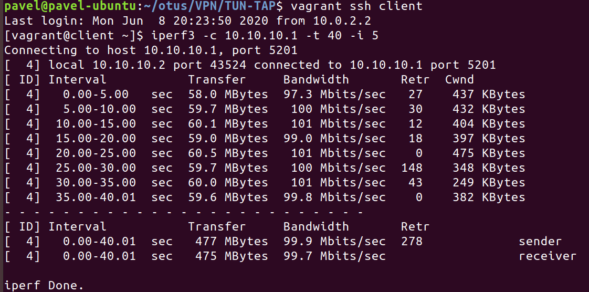
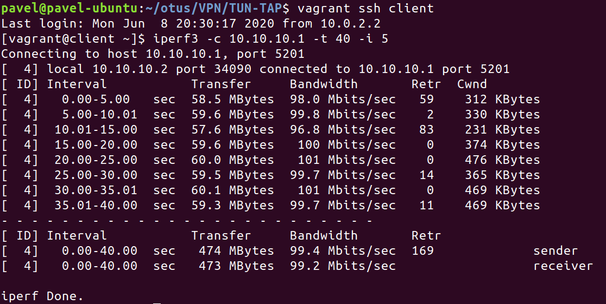

# 1. Сравнение tun и tap

## Описание стенда

В файле [playbook.yml](playbook.yml) изменить значение переменой dev на tun или tap в зависимости от того, какой тип интерфейса желаете получить.
После развертывания стенда будут доступны две ВМ server и client. Между ними настрен VPN канал.

## Разница tun и tap

Tun работает на сетевом уровне и оперирует IP пакетами. Tap работает на канальном уровне, оперирует кадрами и эмулирует работу Ethernet.

## Сравнение скорости tun и tap

Результат измерения скорости tap:

Результат измерения скорости tun:

Скорость передачи у tap немного больше, но в целом они соизмеримы.